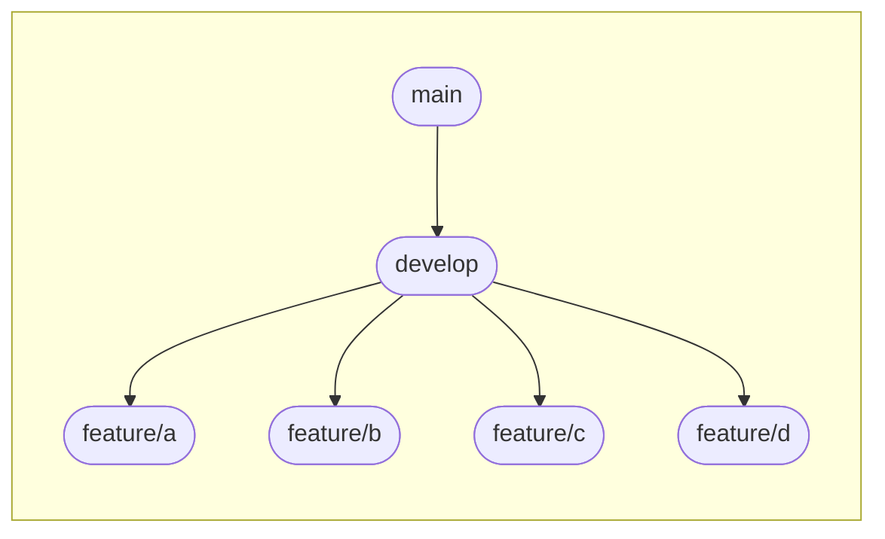

# GitHub 運用テスト

<details><summary>主なコマンド</summary>

## リポジトリをクローン
```
git clone {リポジトリのurl}
```
<br>

## 作業ブランチを作って切り替え
```
git checkout -b {作りたいブランチ名（feature/xxxx）}
```

- ブランチ作成だけ
```
git branch {作りたいブランチ名（feature/xxxx）}
``` 

- ブランチの切り替え
```
git checkout {作りたいブランチ名（feature/xxxx）}
```

- 作業ブランチの確認
```
git branch
```
<br>

## リポジトリの変更を取り込む
```
git pull origin {リモートブランチ名}
```
<br>

## ファイル編集後
編集内容を確認
```
git status
```
<br>

変更を反映
```
git add {変更を反映させたいファイル名}
git commit -m "コミットメッセージ"
git push origin {変更を反映させたいリモートブランチ名}
```
> `git add .`とすることで、すべてのファイルの変更を`add`できます

---
</details>
<br>

# GitHub Flow
今回使うブランチ戦略。**Pull Request**を使う。
<br>

* `main`ブランチ  
    安定ブランチ。常にリリース可能なソースコードを管理。    

* `develop`ブランチ  
	`main`ブランチから派生したブランチ。開発中の各ブランチの`merge`先。

* `feature/xxxx`ブランチ  
    開発する機能に応じて作成。（xxxx: 開発する機能の内容）

<br>

> Pull Request（PR）  
> コードの変更を行なった際、ほかの人にレビューを依頼し、問題がなければメインのコードベースにマージするための機能
<br>


# 運用テスト
ブランチを切ってファイルを追加し、PRを作成して`develop`ブランチにマージする。
<br><br>

## 1. 作業ブランチの作成
図のような感じで、`develop`ブランチから作業ブランチを切り分けます。


<br>

`develop`ブランチに切り替えてから、新規ブランチを作成します。  
（＊には図の通り、a, b, c, dが入ります）
```
git checkout develop        # developブランチに切り替え
git checkout -b feature/＊  # feature/＊ブランチを作成し、そのブランチに切り替え
```
<br>

この状態で以下のコマンドを実行して、自分の作業ブランチに切り替えられているか確認  
```
git branch
```
<br>

## ファイルの追加
エクスプローラを開き、（`explorer .`）テキストファイルを作成します。  
ファイル名は、自分の作業ブランチ名のアルファベットにしておいてください。  
（コマンドでやってもok）
<br>

`feature/a`ブランチなら、`github-test`フォルダは以下のようになっているはず
```
github-test
 ┣━ x.txt
 ┗━ a.txt   # 追加したファイル
```
<br>

ファイルを作成できたので、ローカルに反映させます。
```
git add .
git commit -m "Add ＊.txt"
git push origin feature/＊
```
<br>

GitHubに移動し、自分の作業ブランチを確認すると、ファイルの作成が反映されているはずです。
<br>

## PRの作成
PRを作成し、`develop`ブランチへのマージを行います。

> 画像を貼るのが面倒なので、teamsでやります...